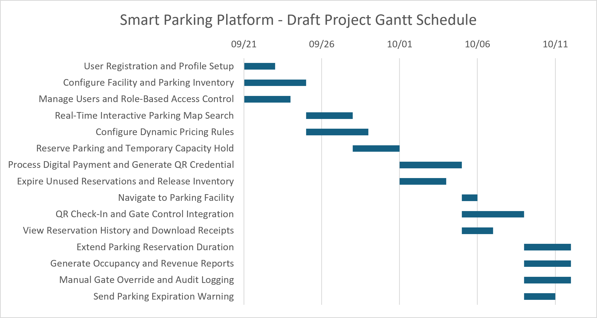
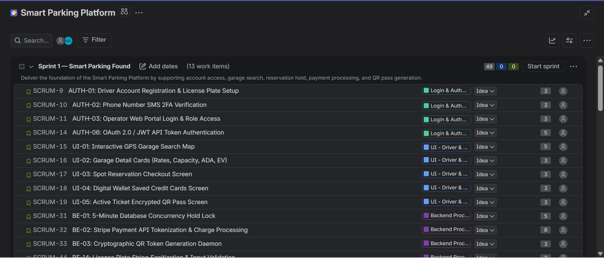
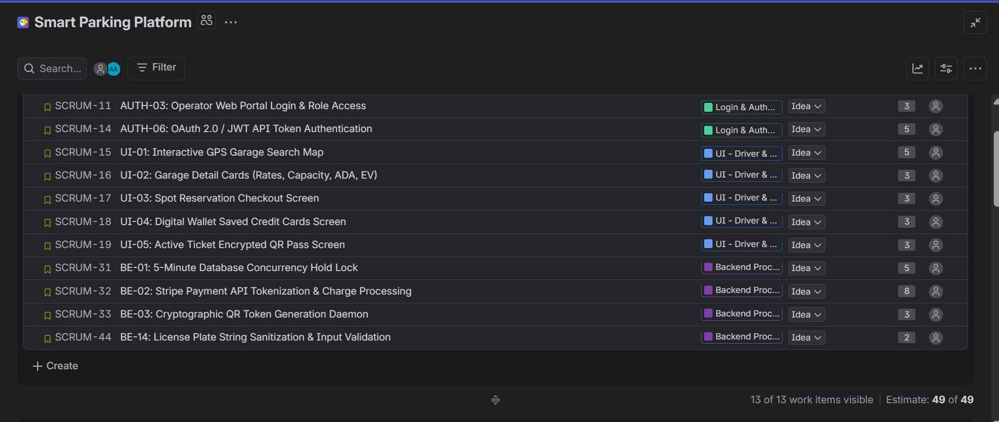
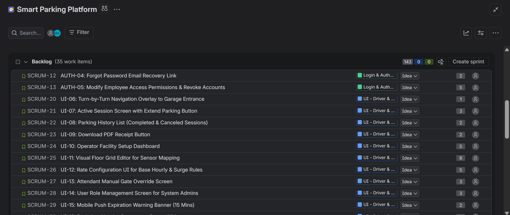
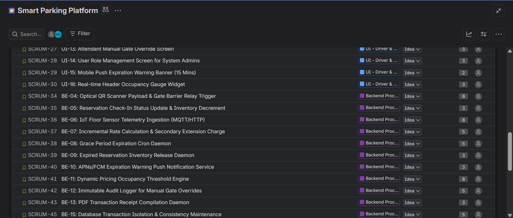
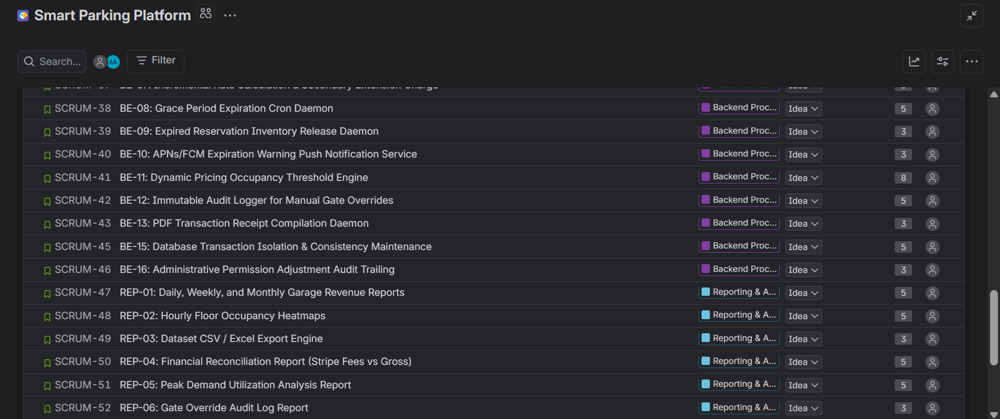
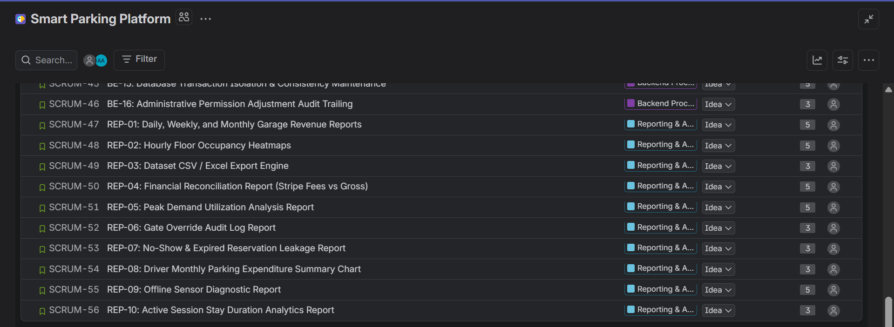

# Software Requirements Specification (SRS)

Project: Smart Parking Platform

Version: 1.4

Date: 10.01.2026


## 1. Introduction

### 1.1 Purpose

This document defines the requirements for the $oftware ¢orp. Smart Parking Platform. It describes the systems users, functional behavior, quality expectations, business rules, and use cases that will later assist us in our estimations, scheduling, design, and implementation.

### 1.2 Scope

The Smart Parking Platform is a double sided parking management solution. The drivers use a mobile application to locate the participating parking facilities, view the availability and rates, reserve parking, make digital payments, receive direction to the facility, gain entry, manage sessions, and view receipts. Parking operators and administrators use a web portal to configure facilities, map the inventory, manage pricing, review reports, and override and manage access. The background processes include removing unused reservations and sending expiration alerts.

### Explicitly Out of Scope

- Physical manufacturing, installation, or hardware maintenance of parking barrier gates, optical scanners, and IoT floor sensors
- Municipal traffic citation enforcement, parking ticket violation processing, and legal collections
- On-site valet or physical attendant staffing operations

## 2. Overall Description

Users: The finished Smart Parking Platform will have several different types of users. Including drivers, parking facility operators and system administrators.

System Environment: The Smart Parking Platform will use both a mobile and web-based environment.

Constraints: The system depends on several outside technologies. Users have to authenticate before they reach protected features, drivers need a supported mobile device, and location based features only work when GPS permissions are granted. Payments run on Stripe. Facilities that want real-time occupancy have to connect compatible sensors to the platform, and QR entry needs compatible scanners and gate hardware. The system also protects sensitive user, payment, and administrative data, and limits administrative features by role.

Assumptions: The Smart Parking Platform assumes that users have reliable internet access while using the application. It also assumes that parking facilities have internet-connected equipment that can communicate with the platform. Drivers are expected to provide account and vehicle information and allow location access when using location-based features. The system assumes that external services such as payment, mapping, messaging, and garage hardware systems are available when their features are needed. It is also assumed that parking operators will keep facility information, pricing rules, operating hours, and parking inventory configurations up to date.

### Evaluation of existing software solutions

- ParkMobile / PayByPhone: Market leaders in municipal and on-street parking. They are widely used and make mobile parking payments convenient, but they mainly track paid parking time rather than whether a vehicle is physically still occupying the space. This can make availability information less accurate.
- SpotHero / ParkWhiz: Strong competitors in off-street garage reservations and advance parking passes. They are useful for pre-booking, but they generally rely more on reserved inventory than direct integration with garage hardware such as barrier gates and live IoT parking sensors.
- Passport Enterprise: A comprehensive municipal parking and enforcement platform with strong backend capabilities. However, it is more focused on administration and enforcement, while the driver experience is less central. It also does not emphasize features such as turn-by-turn navigation and a fully connected driver journey.
- Our Smart Parking Platform: Our solution is designed to connect the driver experience with real-time garage operations. The main difference is the combination of live parking availability, IoT sensor data, garage gate integration, reservations, payments, navigation, and parking-session management within one platform.

## 3. Functional Requirements

- FR1: The system shall allow drivers to create an account and save their basic vehicle information.
- FR2: The system shall verify new driver account by sending a verification code through SMS.
- FR3: The system shall allow drivers to use their current location to search for nearby parking facilities.
- FR4: The system shall show drivers current parking availability, parking rates, operating hours, and available parking types for each facility.
- FR5: The system shall allow drivers to reserve available parking for a selected arrival and departure time.
- FR6: The system shall temporarily hold the selected parking availability during checkout so another driver cannot reserve the same availability at the same time.
- FR7: The system shall allow drivers to make digital payment's through Stripe using the supported payment methods.
- FR8: The system shall generate a QR entry credential after a reservation has been successfully paid for.
- FR9: The system shall provide directions to the selected parking facility through a supported mapping and location service.
- FR10: The system shall allow drivers to check in at a parking facility by scanning their reservation QR code at the entrance.
- FR11: The system shall update the reservation from Reserved to checked in after an entry and update the facility's occupancy information.
- FR12: The system shall allow drivers to extend a parking session when more time and parking capacity is available.
- FR13: The system shall process any additional payment required when a driver extends a parking session.
- FR14: The system shall allow drivers to view their previous parking sessions, transactions, and reservations.
- FR15: The system shall allow drivers to generate and download PDF receipts for previous parking transactions.
- FR16: The system will allow parking operators to create, read, update and delete when needed, facility information such as capacity, parking types, operating hours, floors, and sensor maps.
- FR17: The system shall allow parking operators to create and manage dynamic pricing rules based on conditions such as demand and current occupancy.
- FR18: The system shall allow operators and finance personnel to view and export garage occupancy and revenue reports.
- FR19: The system shall allow attendants to manually open a parking gate when a QR check-in process fails.
- FR20: The system shall record gate overrides, including the employee, time, vehicle information, and reason for the action.
- FR21: The system will allow administrators to modify user roles and permissions and suspend or revoke employee access using role based access.
- FR22: The system shall make reservations automatically expire when the driver does not check in within the grace period and return that parking capacity to available inventory.
- FR23: The system shall automatically warn drivers when an active parking session is approaching its expiration time and allow them to return to the app to extend the session when permitted.

## 4. Non-Functional Requirements

- NFR1: Authentication - The system will require users to authenticate before accessing protected driver, operator, finance, or administrative functions.
- NFR2: Authorization - The system shall use role based access control to restrict system functions based on each user's role.
- NFR3: Connectivity - The system shall require network connectivity for functions that are dependent on real time parking information, payments, notifications, and more.
- NFR4: Hardware Compatibility - The system shall support compatible parking sensors, QR scanners, gate controllers, and other approved hardware.
- NFR5: Data Consistency - The system shall maintain consistent reservation, payment, check-in, occupancy, and parking availability information across the full protfolio.
- NFR6: Security - The system shall protect sensitive information during transmission and storage.
- NFR7: Payment Security - The system shall process digital payments through the approved payment provider and will avoid storing unnecessary payment information.
- NFR8: Usability - The driver mobile application shall provide a graphical user interface for searching, reserving, paying for, entering, and managing parking sessions.
- NFR9: Administrative Usability - The operator web portal shall organize facility management, pricing, reporting, gate controls, and access-management functions in an accessible interface.
- NFR10: Mobile Compatibility - The mobile application shall operate on supported mobile devices that provide internet access, location services, QR-code display capability, and push-notification support.
- NFR11: Web Compatibility - The operator and administrative portal shall operate through the platform's supported modern web browsers.
- NFR12: Integration - The system shall support communication with external payment, mapping, notification, sensor, scanner, and gate-control services.
- NFR13: Auditability - The system shall maintain records of administrative actions, including gate overrides and access-control changes.
- NFR14: Scalability - The system shall be designed to support additional users, parking facilities, reservations, and connected devices without requiring a complete redesign and completely new infrastructure.
- NFR15: Maintainability - The system shall allow facility information, pricing rules, integrations, and configurable system settings to be updated without rebuilding the entire platform.
- NFR16: Privacy - The system shall access driver location information only when a location based task is required and the user has granted the appropriate permission.
- NFR17: Reliability - The system shall preserve completed reservation, payment, check-in, and administrative transaction records if an individual external service temporarily becomes unavailable.
- NFR18: Availability - The system shall be available to users during the supported operating periods of participating parking facilities.

## 5. Use Case Example

Category A: Driver and Mobile Application Interactions

### UC-01: User Account Registration and Profile Setup

- Actor: Driver
- Precondition: The mobile application is installed on the driver's device and the device has internet access.

Steps:

1. The driver launches the mobile application and selects "Register New Account".
2. The driver enters an email address, password, phone number, vehicle license plate, and vehicle category.
3. The system validates the entered information and checks whether the email address is already registered.
4. The system sends a verification code to the driver's phone through SMS.
5. The driver enters the verification code.
6. The system validates the code and activates the account.

Postcondition: The driver's account is active, the vehicle information is saved, and the driver is logged into the application.

### UC-02: Real-Time Interactive Parking Map Search

- Actor: Driver
- Precondition: The driver is authenticated and location services are enabled on the mobile device.

Steps:

1. The driver opens the parking map.
2. The system retrieves the driver's current location.
3. The system searches for participating parking facilities near the driver's location.
4. The system retrieves current parking availability and published parking rates.
5. The system displays nearby facilities on an interactive map.
6. The driver selects a facility.
7. The system displays facility details such as parking availability, parking types, EV charging availability, ADA parking, height restrictions, operating hours, and parking rates.

Postcondition: The driver can view nearby parking facilities and their current parking information.

### UC-03: Reserve Parking

- Actor: Driver
- Precondition: The driver is authenticated and the selected parking facility has reservable capacity for the requested time period.

Steps:

1. The driver selects a parking facility.
2. The driver enters the desired arrival time, departure time, and parking type.
3. The system checks parking availability for the selected time period.
4. The system calculates the reservation cost.
5. The driver reviews the reservation details.
6. The driver selects "Proceed to Checkout".
7. The system creates a temporary reservation hold so another driver cannot reserve the same availability during checkout.

Postcondition: The requested parking capacity is temporarily held for the driver while payment is completed.

### UC-04: Process Digital Payment

- Actor: Driver
- Supporting System: Stripe Payment Service
- Precondition: The driver has an active temporary reservation hold and is on the payment screen.

Steps:

1. The driver selects a saved payment method or enters a supported payment method.
2. The system sends the payment request to Stripe.
3. Stripe processes the payment authorization.
4. Stripe returns the transaction result to the system.
5. The system records the successful transaction.
6. The system confirms the parking reservation.
7. The system generates a unique QR entry credential for the reservation.

Postcondition: The payment is recorded as successful, the reservation is confirmed, and the driver's QR entry credential is available in the application.

### UC-05: Navigate to Parking Facility

- Actor: Driver
- Supporting System: Mapping and Location Service
- Precondition: The driver has a confirmed parking reservation.

Steps:

1. The driver opens the active reservation.
2. The driver selects "Navigate to Facility".
3. The system sends the facility location to the mapping and location service.
4. The mapping and location service returns routing information.
5. The application displays navigation directions.
6. As the driver approaches the facility, the application keeps the QR entry credential easy to access.

Postcondition: The driver arrives at the selected parking facility with the QR entry credential available for check-in.

### UC-06: Check In at Parking Facility via QR Code

- Actor: Driver
- Supporting System: Facility QR Scanner and Gate Controller
- Precondition: The driver has a valid reservation and is at the parking facility entrance during the permitted arrival period.

Steps:

1. The driver presents the QR entry credential to the facility scanner at the entrance.
2. The scanner reads the QR entry credential and sends it to the system for validation.
3. The system verifies the reservation status, time period, and associated vehicle information.
4. The system authorizes entry.
5. The system sends an open command to the gate controller.
6. The gate barrier opens.
7. The system updates the reservation from Reserved to Checked-In.
8. The system records the driver's arrival time.
9. The system updates the facility's occupancy information.

Postcondition: The driver is admitted to the parking facility and the parking session becomes active.

### UC-07: Extend Parking Reservation Duration

- Actor: Driver
- Supporting System: Stripe Payment Service
- Precondition: The driver has an active checked-in parking session and the facility can support the requested extension.

Steps:

1. The driver opens the active parking session.
2. The driver selects "Extend Parking Duration".
3. The driver chooses the amount of additional parking time.
4. The system checks whether more time and parking capacity are available.
5. The system calculates the additional payment required.
6. The driver confirms the extension.
7. The system processes the additional payment.
8. The system updates the reservation expiration time.

Postcondition: The parking session is extended and the updated transaction is recorded.

### UC-08: View Reservation History and Download Receipts

- Actor: Driver
- Precondition: The driver is authenticated and has at least one previous parking transaction.

Steps:

1. The driver opens "Parking History".
2. The system retrieves completed and canceled parking sessions associated with the driver's account.
3. The system displays the driver's previous parking sessions, transactions, and reservations.
4. The driver selects a specific transaction.
5. The system displays the transaction details.
6. The driver selects "Download Receipt PDF".
7. The system generates the requested PDF receipt.

Postcondition: The driver can view past parking activity and download a receipt for the selected transaction.

### UC-09: Configure Facility and Parking Inventory

- Actor: Parking Facility Operator
- Precondition: The operator is authenticated and has permission to manage the parking facility.

Steps:

1. The operator opens "Facility Setup".
2. The operator enters the facility name, address, total capacity, operating hours, number of floors or zones, and supported parking types.
3. The operator defines parking types such as Standard, Compact, EV, and ADA.
4. The operator maps supported parking sensors to physical spaces or parking zones.
5. The operator saves the facility configuration.
6. The system validates the facility information.
7. The system publishes the facility so drivers can find it when searching for nearby parking.

Postcondition: The parking facility and its inventory configuration are active and available to drivers.

### UC-10: Configure Dynamic Pricing Rules

- Actor: Parking Facility Operator or Administrator
- Precondition: The operator is authenticated and authorized to manage facility pricing.

Steps:

1. The operator opens "Rate Management".
2. The operator creates a dynamic pricing rule.
3. The operator selects an occupancy threshold or other permitted pricing condition.
4. The operator defines the associated price adjustment.
5. The system checks the proposed rule against configured pricing limits and business rules.
6. The system alerts the operator if the proposed rule violates a configured restriction.
7. The operator activates an approved pricing rule.
8. The system applies the pricing rule when the configured conditions are met.

Postcondition: The approved dynamic pricing rule is active for the selected parking facility.

### UC-11: Generate Garage Occupancy and Revenue Report

- Actor: Parking Facility Operator or Finance Personnel
- Precondition: The user is authenticated and has reporting permissions.

Steps:

1. The user opens "Analytics & Reports".
2. The user selects a parking facility.
3. The user selects a reporting period.
4. The user selects the desired reporting metrics.
5. The system retrieves the required occupancy and transaction data.
6. The system calculates the requested metrics.
7. The system displays charts and summary information.
8. The user may export the report in a supported format.

Postcondition: The requested occupancy or revenue report is displayed and can be exported when needed.

### UC-12: Manual Gate Override

- Actor: Facility Attendant or Parking Operator
- Precondition: The attendant is authenticated and the gate control system is available.

Steps:

1. The attendant identifies a driver experiencing a gate or QR check-in problem.
2. The attendant opens the "Gate Override" function.
3. The attendant enters the vehicle license plate.
4. The attendant records the reason for the override.
5. The system records the employee, the time of the override, the vehicle information, and the reason for the action.
6. The attendant confirms the override.
7. The system sends the authorized command to open the gate.

Postcondition: The gate opens and the override is recorded in the system audit log.

### UC-13: Manage Users and Role-Based Access Control

- Actor: System Administrator
- Precondition: The administrator is authenticated and authorized to manage system access.

Steps:

1. The administrator opens "User & Access Control".
2. The administrator searches for an employee or administrative user.
3. The system displays the user's current role and permissions.
4. The administrator modifies the user's role or permissions when necessary.
5. The administrator may suspend or revoke access when required.
6. The system updates the user's role-based access control permissions.
7. The system records the administrative change.

Postcondition: The user's access permissions and account status reflect the approved administrative changes.

### UC-14: Expire Unused Reservation and Release Inventory

- Trigger: The reservation grace period expires without a successful driver check-in.
- Precondition: The reservation start time has passed by the configured grace period and the driver has not checked in.

Steps:

1. The system identifies reservations that have passed the permitted check-in grace period.
2. The system verifies that no successful check-in occurred.
3. The system changes the reservation status to No-Show / Expired.
4. The system returns that parking capacity to available inventory.
5. The system applies any configured facility cancellation or no-show policy.
6. The system records the expiration event.
7. The system sends an expiration notification to the driver.

Postcondition: The reservation is closed and the previously reserved parking capacity becomes available again.

### UC-15: Send Parking Expiration Warning

- Trigger: An active parking session reaches the configured expiration-warning threshold.
- Supporting System: Apple Push Notification Service and Firebase Cloud Messaging
- Precondition: The driver has an active checked in parking session and notifications are enabled.

Steps:

1. The system monitors active parking session expiration times.
2. The system identifies a session that has reached the warning threshold.
3. The system creates an expiration warning message.
4. The system sends the notification through the appropriate mobile notification service.
5. The driver's device receives and displays the notification.
6. The system records the notification event.

Postcondition: The driver receives a warning that the parking session is approaching expiration and can return to the application to extend the session when permitted.

## 6. Work Breakdown Structure, Agile Estimation, and Project Schedule

### 6.1 Estimation Approach

The Smart Parking Platform will use a three level Work Breakdown Structure to break the project into smaller, manageable areas of work. Level 1 represents the smart parking platform, level 2 represents the major parts of the platform, and level 3 represents the individual features and tasks that need to be completed.

Story points will be assigned to level 3 tasks using the Fibonacci scale of 1, 2, 3, 5, 8, and 13. The story points are based on how complicated the task is, the risk, and the amount of effort to complete it. The points are used to compare the tasks to each other and do not represent the exact hours to complete the work.

Navigate to Parking Facility (Use Case 5) will be used as the one story point baseline because it is one of the simpler features in the platform. The system sends the selected parking facility location to the mapping service and receives the routing information back. The other tasks will be estimated by comparing them to this baseline.

### 6.2 Three-Level Work Breakdown Structure

```text
1.0 Smart Parking Platform

1.1 Driver Account and Access
    1.1.1 User Registration and Profile Setup (UC-01) [3 SP]

1.2 Parking Discovery and Reservation
    1.2.1 Real Time Interactive Parking Map Search (UC-02) [5 SP]
    1.2.2 Reserve Parking and Temporary Capacity Hold (UC-03) [5 SP]
    1.2.3 Navigate to Parking Facility (UC-05) [1 SP]

1.3 Payment and Driver Session Management
    1.3.1 Process Digital Payment and Generate QR Credential (UC-04) [8 SP]
    1.3.2 Extend Parking Reservation Duration (UC-07) [5 SP]
    1.3.3 View Reservation History and Download Receipts (UC-08) [3 SP]

1.4 Facility Operations and Hardware Integration
    1.4.1 QR Check-In and Gate Control Integration (UC-06) [8 SP]
    1.4.2 Configure Facility and Parking Inventory (UC-09) [8 SP]
    1.4.3 Manual Gate Override and Audit Logging (UC-12) [5 SP]

1.5 Operator, Reporting and Administration
    1.5.1 Configure Dynamic Pricing Rules (UC-10) [8 SP]
    1.5.2 Generate Occupancy and Revenue Reports (UC-11) [5 SP]
    1.5.3 Manage Users and Role-Based Access Control (UC-13) [5 SP]

1.6 Automated Platform Services
    1.6.1 Expire Unused Reservations and Release Inventory (UC-14) [5 SP]
    1.6.2 Send Parking Expiration Warning (UC-15) [3 SP]
```

### 6.3 Story Point Estimation

| WBS ID | Work Package                                       | Story Points | Reason for Estimate                                                                                                               |
| ------ | -------------------------------------------------- | -----------: | --------------------------------------------------------------------------------------------------------------------------------- |
| 1.1.1  | User Registration and Profile Setup                |            3 | Includes creating an account, saving vehicle information, checking the users information, and sending an SMS code.                |
| 1.2.1  | Real-Time Interactive Parking Map Search           |            5 | Uses the drivers location, searches nearby facilities, and shows current availability, rates, hours, and parking types.           |
| 1.2.2  | Reserve Parking and Temporary Capacity Hold        |            5 | Checks availability, calculates the cost, and holds the parking capacity while the driver completes checkout.                     |
| 1.2.3  | Navigate to Parking Facility                       |            1 | Baseline: Mainly sends the facility location to the mapping service and displays the directions that are returned.                |
| 1.3.1  | Process Digital Payment and Generate QR Credential |            8 | Uses Stripe to process digital payment's, records the transaction, confirms the reservation, and creates the QR entry credential. |
| 1.3.2  | Extend Parking Reservation Duration                |            5 | Checks if more time and parking capacity is available, calculates the extra cost, processes payment, and updates the reservation. |
| 1.3.3  | View Reservation History and Download Receipts     |            3 | Retrieves previous parking sessions and transactions and creates a PDF receipt when the driver requests one.                      |
| 1.4.1  | QR Check-In and Gate Control Integration           |            8 | Checks the QR code, communicates with the gate system, opens the gate, and updates the reservation and occupancy.                 |
| 1.4.2  | Configure Facility and Parking Inventory           |            8 | Allows operators to enter facility information, set up floors or zones, parking types, and map supported sensors.                 |
| 1.4.3  | Manual Gate Override and Audit Logging             |            5 | Allows an authorized employee to open the gate and records the employee, vehicle, time, and reason.                               |
| 1.5.1  | Configure Dynamic Pricing Rules                    |            8 | Allows operators to set pricing rules based on demand or occupancy and checks the rules against pricing limits.                   |
| 1.5.2  | Generate Occupancy and Revenue Reports             |            5 | Retrieves parking and transaction information, calculates the requested results, and allows reports to be exported.               |
| 1.5.3  | Manage Users and Role-Based Access Control         |            5 | Allows administrators to change roles and permissions, remove access when needed, and record the change.                          |
| 1.6.1  | Expire Unused Reservations and Release Inventory   |            5 | Finds reservations that passed the grace period, closes them, returns the parking capacity, and notifies the driver.              |
| 1.6.2  | Send Parking Expiration Warning                    |            3 | Monitors active parking sessions and sends the driver a warning when the session is close to expiring.                            |

### 6.4 Project Schedule and Task Dependencies

| WBS ID | Work Package                                       | Predecessor  | Dependency |  SP | Estimated Duration |
| ------ | -------------------------------------------------- | ------------ | ---------- | --: | -----------------: |
| 1.1.1  | User Registration and Profile Setup                | None         | -          |   3 |             2 days |
| 1.4.2  | Configure Facility and Parking Inventory           | None         | -          |   8 |             4 days |
| 1.5.3  | Manage Users and Role-Based Access Control         | None         | -          |   5 |             3 days |
| 1.2.1  | Real-Time Interactive Parking Map Search           | 1.4.2        | FS         |   5 |             3 days |
| 1.2.2  | Reserve Parking and Temporary Capacity Hold        | 1.1.1, 1.2.1 | FS         |   5 |             3 days |
| 1.3.1  | Process Digital Payment and Generate QR Credential | 1.2.2        | FS         |   8 |             4 days |
| 1.2.3  | Navigate to Parking Facility                       | 1.3.1        | FS         |   1 |              1 day |
| 1.4.1  | QR Check-In and Gate Control Integration           | 1.3.1, 1.4.2 | FS         |   8 |             4 days |
| 1.3.2  | Extend Parking Reservation Duration                | 1.4.1        | FS         |   5 |             3 days |
| 1.3.3  | View Reservation History and Download Receipts     | 1.3.1        | FS         |   3 |             2 days |
| 1.5.1  | Configure Dynamic Pricing Rules                    | 1.4.2        | FS         |   8 |             4 days |
| 1.5.2  | Generate Occupancy and Revenue Reports             | 1.4.1        | FS         |   5 |             3 days |
| 1.4.3  | Manual Gate Override and Audit Logging             | 1.4.1, 1.5.3 | FS         |   5 |             3 days |
| 1.6.1  | Expire Unused Reservations and Release Inventory   | 1.2.2        | FS         |   5 |             3 days |
| 1.6.2  | Send Parking Expiration Warning                    | 1.4.1        | FS         |   3 |             2 days |

Finish-to-Start (FS) means one task should be completed before the next related task begins. Some of the work can also happen at the same time when the tasks do not directly depend on each other. For example, account setup, facility setup, and access control can begin separately, while payment cannot be completed until the reservation process is working.

### 6.5 Project Milestones

Milestone 1: Requirements and Planning Baseline

The SRS, use cases, Work Breakdown Structure, story point estimates, and initial project schedule are completed.

Milestone 2: Core Driver Functions Completed

Driver registration, parking search, and reservation functions are working together.

Milestone 3: Payment and Parking Entry Integration Completed

Stripe payment processing, QR credential generation, and parking facility check-in are connected.

Milestone 4: Operator and Automated Services Completed

Facility management, pricing, reporting, access management, reservation expiration, and parking expiration warnings are available.

Milestone 5: Final Smart Parking Platform Delivery

The full Smart Parking Platform is reviewed, tested, and prepared for final project delivery.

### 6.6 Gantt Chart



Figure 1. Smart Parking Platform Draft Project Schedule and Task Dependencies.

| Date       | Milestone                                       |
| ---------- | ----------------------------------------------- |
| 09/18/2026 | Requirements and Planning Baseline              |
| 09/30/2026 | Core Driver Functions Completed                 |
| 10/08/2026 | Payment and Parking Entry Integration Completed |
| 10/11/2026 | Operator and Automated Services Completed       |
| 12/04/2026 | Final Smart Parking Platform Delivery           |

## 7.2 Sprint 1 Planning

For Sprint 1, I selected 13 stories totaling 49 story points. I named the sprint Sprint 1 — Smart Parking Foundation because I wanted to focus on the main features that a driver would need to get started with the platform. My sprint goal is to deliver the foundation for account access, garage search, reservation hold, payment processing, and QR pass generation.

I selected 4 Login & Authentication stories worth 14 points, 5 UI stories worth 17 points, and 4 Backend stories worth 18 points. I prioritized these stories because they support each other. For example, a driver needs to create an account and find a garage before making a reservation. The platform also needs to hold the parking capacity during checkout, process the payment, and generate a QR pass after the reservation is confirmed.
I also considered the dependencies from my earlier project planning. For the initial garage map and detail cards, I would use sample facility data because the full operator facility setup is still in the remaining backlog. This allows me to plan the driver experience first without treating every backend and operator feature as completed.
Since this is my first sprint, the 49 story points represent my proposed scope, not an established team velocity. I have not started the sprint in Jira because this stage is focused on planning. The remaining 35 stories will stay in the product backlog for future sprint planning, where I can adjust priorities based on what gets completed and what the project needs next.

## 7.3 Jira Backlog and Sprint Evidence
I created the Scrum project in Jira, added the four epics, and imported all 48 stories. I then assigned each story to its matching epic and moved my 13 selected stories into Sprint 1. My Jira backlog shows the Sprint 1 goal, the 49-point estimate, and the 35 stories remaining in the product backlog.













## 8. Risk, Quality, and Communication Management

In this section I looked at what could go wrong with the Smart Parking Platform, how I would check that everything works, and how we would keep everyone updated. I used a five person team for the communication part and picked some numbers to help measure the quality of the system.

### 8.1 Risk Management Plan and Risk Register

#### 8.1.1 Risk Management Strategy

I dont want to only look at software bugs because this platform relies on more than just the app. If a sensor stops working, a payment doesnt go through or a Houston storm knocks out power, drivers still have a problem. So I looked at technical, operational, schedule, cost and weather risks. For each one I gave it a score, somebody to handle it and a plan. We can come back to the list whenever something changes.

The four responses I would use are:

- Avoidance: Change the plan so we can avoid the risk entirely, for example removing an optional integration that has not been approved.
- Mitigation: Put something in place to reduce the chance of the problem or how badly it affects us. This could be testing, monitoring or a backup plan.
- Transfer: Use a contract or insurance for some of the financial risk. We still need to know which parts we are responsible for.
- Acceptance: Recognize the risk and continue monitoring it. We may still need a fallback even when we decide to accept it.

Stripe is a good example. Even though it handles payments, we still have to make sure our side of the connection is secure. The same goes for cloud services. Having a provider does not automatically take away our responsibility when something goes wrong.

#### 8.1.2 Probability and Impact Matrix

I used a scale of 1 to 5 for how likely each risk is and how much it would affect us. Then multiplied the two numbers:

Risk score = Probability x Impact 

Probability is how likely I think something is to happen. Impact is how much trouble it would cause for the project or for someone trying to park.

| Rating | Probability | Impact |
| --- | --- | --- |
| 1 | Rare | Very small issue we can handle as part of the task. |
| 2 | Unlikely | Minor issue with a simple workaround or small amount of rework. |
| 3 | Possible | Moderate issue that may require changes to work, schedule or costs. |
| 4 | Likely | Major issue that could delay a milestone or affect reservations, payments or entry. |
| 5 | Almost certain | Severe issue such as sensitive data exposure, serious transaction loss or a long disruption. |

I grouped the scores into low (1 to 4), medium (5 to 9), high (10 to 16) and critical (17 to 25). Low is green, medium is yellow and both high and critical are red. I kept the scores in the chart so its still easy to tell them apart.

| Probability / Impact | 1 | 2 | 3 | 4 | 5 |
| --- | --- | --- | --- | --- | --- |
| 5 | 5 Medium | 10 High | 15 High | 20 Critical | 25 Critical |
| 4 | 4 Low | 8 Medium | 12 High | 16 High | 20 Critical |
| 3 | 3 Low | 6 Medium | 9 Medium | 12 High | 15 High |
| 2 | 2 Low | 4 Low | 6 Medium | 8 Medium | 10 High |
| 1 | 1 Low | 2 Low | 3 Low | 4 Low | 5 Medium |

A critical risk needs attention right away. High risks should be handled before releasing the part of the system they affect. I would check medium risks each sprint and keep low risks on the list in case they change. Something serious like unauthorized gate access needs to be reported right away, regardless of the score.

#### 8.1.3 Risk Register

I started each one as Open. As work continues, the status can change depending on whether we are working on it, watching it or have fixed the problem.

**RSK-01: Stripe payment outage or uncertain payment result**

- Category: Technical / Financial
- Probability: 2 | Impact: 5 | Score: 10, High (Red)
- Owner: Backend / Database Lead | Strategy: Mitigation
- Risk: Stripe could time out while someone is paying. If we dont know whether the payment went through, we also shouldnt tell the driver their parking is confirmed (UC-04).
- Plan: First check the payment status before trying to charge the driver again. If we need to retry, use the same idempotency key so the retry doesnt create a second payment. When Stripe isnt responding, we should stop those checkouts and tell the driver the payment is pending or unavailable. Only give out the QR code after payment is confirmed. If too much time passes, check that parking is still available and refund through the normal process if it isnt.

**RSK-02: Parking sensor information is missing or outdated**

- Category: Technical / Operational
- Probability: 3 | Impact: 4 | Score: 12, High (Red)
- Owner: Integration Lead | Strategy: Mitigation
- Risk: The sensor could stop sending information and the app may still show a parking space as open when it really isnt (FR4, NFR5, NFR12).
- Plan: Keep track of the last sensor update and try reconnecting if it stops. I would flag information that hasnt updated in 60 seconds. Until we can confirm a space is actually available, dont let drivers reserve it. The garage could provide a confirmed update when needed. Then compare the records before letting reservations start again, because just counting cars coming through the gate wont tell us which spaces are free.

**RSK-03: Two drivers reserve the same parking capacity**

- Category: Technical / Data
- Probability: 3 | Impact: 4 | Score: 12, High (Red)
- Owner: Backend / Database Lead | Strategy: Mitigation
- Risk: Two drivers could try to book the last available space at the same time, and both might end up thinking its theirs (FR6, NFR5, UC-03).
- Plan: The system needs to check availability and hold the space together, not as two separate steps where someone else could book between them. I would start with a five minute checkout hold and test what happens when multiple people book at once, refresh or retry. If the system finds two reservations for the same capacity, stop those reservations and check the database records. We should only free a hold after confirming it expired. A Redis lock might help, but the database still needs to enforce the limit.

**RSK-04: QR scanner or garage gate does not respond**

- Category: Operational / Integration
- Probability: 2 | Impact: 4 | Score: 8, Medium (Yellow)
- Owner: Integration Lead | Strategy: Mitigation
- Risk: A driver paid for parking and has a valid QR code, but the scanner wont read it or the gate doesnt open (UC-06).
- Plan: Test normal QR codes, expired codes, incorrect codes and someone scanning the same code twice. If the gate doesnt open but the app and gate controller still work, an authorized attendant can use the manual override. We need to save who opened it, when, which vehicle and why (FR20). If the gate itself is broken or offline, the garage would use its own procedure.

**RSK-05: Expiration notification is not delivered**

- Category: Operational
- Probability: 3 | Impact: 2 | Score: 6, Medium (Yellow)
- Owner: Mobile / Web Lead | Strategy: Mitigation, with remaining delivery risk accepted
- Risk: A drivers warning about their parking time might not reach their phone (FR23, UC-15).
- Plan: Record whether Apple or Firebase accepted the notification and retry failed alerts while there is still time. Drivers should also see their end time when they open the app. We could look at text messages later, but that would add cost and require consent. Sending a notification doesnt always mean somebody saw it.

**RSK-06: Houston weather causes a local power or internet outage**

- Category: Environmental / Operational
- Probability: 2 | Impact: 5 | Score: 10, High (Red)
- Owner: QA / Operations Lead | Strategy: Mitigation
- Risk: Severe weather can affect garage power, connections, sensors and entry operations.
- Plan: Watch for garages losing their connection. If a garage loses power or internet, stop new bookings there and let drivers know. Once service comes back, compare the parking and payment records before everything returns to normal. The garage would handle the gate and other physical problems using its own outage procedure.

**RSK-07: A developer is unavailable during Sprint 1**

- Category: Schedule / Resource
- Probability: 3 | Impact: 3 | Score: 9, Medium (Yellow)
- Owner: Project Manager | Strategy: Mitigation
- Risk: One missing team member could hold up several tasks that depend on their work.
- Plan: I would keep the notes and Jira tasks updated so somebody else can pick up work if needed. For important tasks, more than one person should understand what is going on. If someone is out, we can move the work around and decide which lower priority stories can wait. After that, update our sprint estimates.

**RSK-08: Cloud services and integrations cost more than expected**

- Category: Financial / Scope
- Probability: 3 | Impact: 3 | Score: 9, Medium (Yellow)
- Owner: Project Manager | Strategy: Mitigation / Avoidance
- Risk: Cloud resources, maps, messages or extra reliability features could push costs beyond the approved budget.
- Plan: Keep an eye on how much the cloud services, maps and messages are costing us. We should turn off testing resources we arent using and put optional features on hold if the costs get too high. Any extra spending would need to be checked against the budget before changing the plan.

**RSK-09: Unauthorized use of administrative access or gate overrides**

- Category: Security / Operational
- Probability: 2 | Impact: 5 | Score: 10, High (Red)
- Owner: Backend / Database Lead | Strategy: Mitigation
- Risk: An unauthorized person accesses administrator features or uses the manual gate override (NFR2, NFR13, UC-12, UC-13).
- Plan: Check permissions on the server, not just by hiding a button in the app. Protect login information and keep a record of administrative actions. If someone tries to use a feature they shouldnt have access to, or we see an unusual gate override, limit access and investigate. Keep the logs so we can see what happened, then test the fix before allowing access again.

I would go back through the risks every week and at the end of each sprint. If one of these things actually happens, it becomes an issue we need to work on, not just something sitting on the risk list.

### 8.2 Quality Management Plan

#### 8.2.1 Quality Assurance

Quality assurance is about trying to prevent problems while we build the platform. Before starting a Jira story, I want us to know what needs to be done for it to count as complete. Someone else should review code before it gets added to the main branch. Testing and documentation should be part of finishing a task, not things we remember at the very end.

Pull requests should run automatic checks too. For database changes, test them in staging first and have a way to undo the change if it causes problems. That is how I see qa, trying to catch mistakes in the process. Quality control is more about checking the actual results.

#### 8.2.2 Quality Control

For quality control, I would go through the features in the SRS and see if they work the way we described. My main tests would be:

1. Driver process: Start with someone making an account, finding parking, reserving, paying and getting their QR code. Then test whether the code lets them check in. This covers the payment in UC-04 and entry in UC-06.
2. Payment and reservation problems: Have multiple people try to reserve at once. Test expired holds, payment retries, duplicated responses and payments we cant immediately confirm. The number of spaces, reservations and payments should all match.
3. Sensors, gates and permissions: Try disconnecting the sensors, sending different gate responses and having users open features outside their role. Check whether the logs record the right information. A simulator can help before we have access to the actual equipment.
4. Speed: Have lots of users search for parking at once. Record how many were using the system, how long the test lasted, how fast the searches were and whether any failed.

#### 8.2.3 Quality Targets

I picked a few numbers so we can tell whether the system is meeting the quality goals, instead of just saying it should be fast or reliable.

**Availability (NFR18)**

- Goal: 99.99% availability when participating garages are supposed to be supported.
- Calculation: (Supported minutes - Unavailable minutes) / Supported minutes x 100.
- Check the main system functions and downtime records each month, including planned and unplanned outages during operating hours.
- For a system running all day, that is about 4.32 minutes down in a 30 day month or 52.56 minutes in a year.
- Responsible: qa and operations lead.

**Map search performance (FR3-FR4)**

- Goal: With 1,000 people searching at once for 15 minutes, at least 95% of searches should finish in under 2 seconds and fewer than 1% should fail.
- Start timing when someone searches and stop when the results show on the map. Record the test conditions too.
- Check before release and after major changes. Responsible: qa and operations lead.

**Payment data protection (NFR6-NFR7)**

- Goal: Dont save full card numbers or security codes in the database or logs. Use Stripe payment references and a secure HTTPS connection.
- Before release, check what the app saves and what shows up in logs. Review the payment security requirements too.
- Responsible: backend and database lead.

**Reservation and payment integrity (FR6-FR8, NFR5)**

- Goal: Run 10,000 checkout attempts with up to 100 at the same time and look for double bookings, duplicate charges and repeated QR passes. The goal is zero.
- Include expired holds, retries and timeouts, then compare the payment records to the reservations.
- Responsible: backend and database lead. If we find an issue, we should fix it and run the tests again.

**Gate authorization and audit records (FR19-FR20, NFR2, NFR13)**

- Goal: Block every test where someone without permission tries to open the gate. For every approved override, save who did it, when, the vehicle and the reason.
- Test with people who should have access and people who shouldnt, including after any role changes.
- Responsible: integration lead.

**Parking expiration warning (FR23, UC-15)**

- Goal: Send the warning 15 minutes before parking expires, and get it to the notification service within 60 seconds of that point.
- Test the alerts before each release, including what happens when the provider is down. Keep track of accepted and rejected alerts and whether they reached a device.
- Responsible: mobile and web lead.

Before we release anything, I would make sure the required tests pass and we save the results. I wouldnt release a feature that lets the wrong person open a gate, charges a driver incorrectly or gives someone parking they cant actually use. Smaller bugs can be reviewed with the project manager and product owner to decide what gets fixed now.

### 8.3 Communication Management Plan

#### 8.3.1 Communication Paths

I used five people for this example. To find how many ways they can communicate one on one, I used:

Communication paths = N(N - 1) / 2

N = 5

5(5 - 1) / 2 = 10 possible communication paths

That gives us ten possible connections between team members. If the team gets bigger or smaller, I would just redo the calculation.

The roles I used are project manager, backend and database, mobile and web, integrations, and qa and operations. One person could handle more than one area.

#### 8.3.2 Different Updates for Different People

I dont think everyone needs the same update. If Stripe stops taking payments, the sponsor would probably want to know if drivers can still book, if money is being affected and whether our schedule changes. Whoever is fixing it needs the actual error, what failed, and what we have already tried. Its the same problem, but different people need different details. We should write down decisions in Jira or Teams so we arent looking through old messages later.

#### 8.3.3 Communication Schedule

| Activity | When | Channel | Responsible | Audience and purpose |
| --- | --- | --- | --- | --- |
| Daily team check-in | Each workday during a sprint, up to 15 minutes | Microsoft Teams and Jira | Project Manager | Quick update on what we finished, what is next and where somebody is stuck. Update Jira afterward. |
| Sprint planning | Start of each sprint | Microsoft Teams and Jira | Project Manager | Pick the sprint goal, decide what fits and check which tasks depend on others. |
| Sprint review and retrospective | End of each sprint | Microsoft Teams and Jira | Project Manager | Show what got finished, hear feedback and talk about what to improve next sprint. |
| Weekly stakeholder report | Weekly | Microsoft Teams | Project Manager | Let the sponsor and facility contacts know how the schedule, costs and major problems are looking. Include decisions and due dates. |
| Risk and quality review | Weekly and before each release | Microsoft Teams, Jira and GitHub | QA / Operations Lead | Check open risks, bugs and test results with the project manager. |
| Technical decisions and code reviews | With each proposed change | GitHub pull requests or discussions, linked to Jira | Relevant technical lead | Leave comments, test results and the reason for changes where the team can find them. |
| Urgent escalation | Immediately when detected | Microsoft Teams call or alert, plus an issue record | Risk owner and PM | Call the people handling it, explain what we know, who is working on it and when the next update is coming. Aim for a response within 15 minutes during coverage. |
| Weekly course update | According to the assignment deadline | MS Teams recording, share link through Canvas | Student / Project Manager | Share a 1 to 2 minute camera on recording explaining the new section for the instructor. |


### 8.4 References

- [Stripe - Integration security guide](https://docs.stripe.com/security/guide): Information on payment security and shared PCI responsibilities.
- [Stripe - Idempotent requests](https://docs.stripe.com/api/idempotent_requests): Guidance for safely retrying the same payment operation.
- [AWS - Amazon Compute Service Level Agreement](https://aws.amazon.com/compute/sla/): Cloud uptime and service credit terms.


